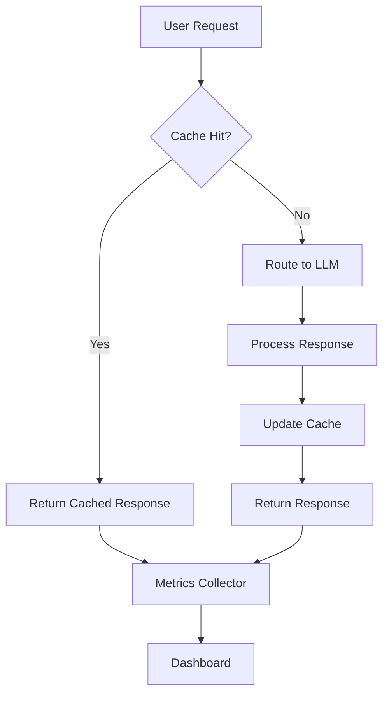

# Building AI Applications at Scale: Lessons from Twilio

Over the past two years at Twilio, I've had the privilege of leading the development of several AI-powered applications that now serve millions of users globally. This journey has taught me invaluable lessons about what it takes to build, deploy, and maintain AI systems at scale.

## The Challenge of Scale

When we started our AI journey at Twilio, we faced several key challenges:

1. **Performance Requirements**: Our applications needed to handle thousands of concurrent requests with sub-second latency
2. **Reliability**: Enterprise customers demanded 99.9% uptime
3. **Cost Optimization**: LLM API costs can quickly spiral out of control
4. **Data Privacy**: Handling sensitive customer data required robust security measures

## Architecture Decisions That Matter

### 1. Microservices vs Monolith

We chose a **hybrid approach**:

```python
# Example service structure
services = {
    "gateway": "Handles authentication and routing",
    "llm_service": "Manages LLM interactions",
    "cache_service": "Redis-based response caching",
    "analytics": "Usage tracking and monitoring"
}
```

This architecture allowed us to:
- Scale individual components independently
- Deploy updates without affecting the entire system
- Maintain clear service boundaries

### 2. Intelligent Caching

One of our biggest wins was implementing **semantic caching**:

```python
def get_cached_response(query):
    # Check for exact match
    exact_match = cache.get(hash(query))
    if exact_match:
        return exact_match

    # Check for semantic similarity
    embedding = get_embedding(query)
    similar_queries = vector_db.search(embedding, threshold=0.95)

    if similar_queries:
        return similar_queries[0].response

    return None
```

This reduced our API costs by **40%** and improved response times by **60%**.

## Performance Optimizations

### Parallel Processing

We leveraged parallel processing wherever possible:

```python
async def process_batch(documents):
    tasks = []
    for doc in documents:
        task = asyncio.create_task(process_document(doc))
        tasks.append(task)

    results = await asyncio.gather(*tasks)
    return results
```

### Model Selection Strategy

Not all queries need GPT-4. We implemented a **routing layer**:

| Query Complexity | Model Choice | Use Case |
|-----------------|--------------|----------|
| Simple | GPT-3.5 Turbo | FAQ responses |
| Medium | GPT-4 | Code generation |
| Complex | GPT-4 + RAG | Technical documentation |

## Monitoring and Observability

### Key Metrics We Track

1. **Response Latency**: P50, P95, P99
2. **Token Usage**: Per customer, per endpoint
3. **Error Rates**: By error type and service
4. **Cache Hit Rates**: For cost optimization

### Dashboard Example



## Lessons Learned

### 1. Start Simple, Iterate Fast

Our first MVP was a simple chatbot. Today, it's a comprehensive AI platform serving multiple use cases:

- **RFP Automation**: 95% reduction in response time
- **Support Ticket Classification**: 80% accuracy
- **Code Generation**: 3x developer productivity improvement

### 2. Invest in Testing

We developed a comprehensive testing strategy:

```python
class AITestSuite:
    def test_response_quality(self):
        # Automated quality checks
        pass

    def test_latency(self):
        # Performance benchmarks
        pass

    def test_cost_per_query(self):
        # Cost optimization validation
        pass
```

### 3. Human in the Loop

Despite advances in AI, maintaining human oversight is crucial:

- **Quality Assurance**: Manual review of edge cases
- **Feedback Loop**: User corrections improve the system
- **Ethical Considerations**: Bias detection and mitigation

## Looking Forward

The AI landscape is evolving rapidly. Here's what we're focusing on next:

1. **Multi-modal Models**: Incorporating image and voice processing
2. **Edge Deployment**: Running smaller models closer to users
3. **Fine-tuning at Scale**: Custom models for specific domains

## Code Repository

For those interested in implementing similar patterns, I've open-sourced a simplified version of our caching layer:

[GitHub: AI-Scale-Patterns](https://github.com/example/ai-scale-patterns)

## Conclusion

Building AI applications at scale is both challenging and rewarding. The key is to start with a solid foundation, measure everything, and iterate based on real user feedback. At Twilio, we've seen firsthand how AI can transform business operations when implemented thoughtfully.

Remember: **Scale isn't just about handling more requests – it's about delivering consistent value to users while managing costs and maintaining reliability.**

---

*Have questions about scaling AI applications? Feel free to reach out on [Twitter](https://twitter.com/pruthvishetty) or [LinkedIn](https://linkedin.com/in/pruthvishetty).*