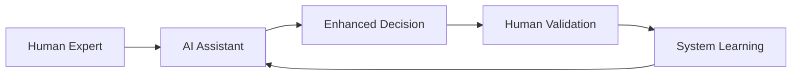
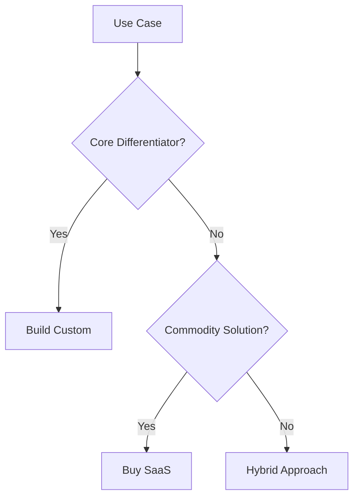

# The Future of GenAI in Enterprise: 2025 and Beyond

After spending the last few years deep in the trenches of enterprise AI implementation, I've observed patterns that point to where the industry is heading. Here's my take on what's coming next.

## Current State of Enterprise AI

Today's enterprise AI landscape is characterized by:

- **Proof of Concepts Everywhere**: Every company has at least one GenAI POC
- **Production Challenges**: Only 20% of POCs make it to production
- **ROI Questions**: Executives asking "What's the real value?"

## Five Trends Shaping the Future

### 1. Specialized Models Over General Purpose

The era of "one model fits all" is ending. We're moving towards:

```javascript
// Future model architecture
const modelPipeline = {
  "extraction": "specialized-extraction-model",
  "reasoning": "domain-specific-reasoner",
  "generation": "fine-tuned-generator",
  "validation": "accuracy-checker-model"
};
```

**Why this matters**: Specialized models are faster, cheaper, and more accurate for specific tasks.

### 2. Hybrid Intelligence Systems

The future isn't AI replacing humans – it's AI amplifying human capabilities:



### 3. Real-Time Adaptive Systems

Static prompts are giving way to dynamic, context-aware systems:

```python
class AdaptiveAI:
    def __init__(self):
        self.context_window = []
        self.user_preferences = {}

    def generate_response(self, query):
        # Adapt based on:
        # - Previous interactions
        # - User feedback
        # - Current context
        # - Performance metrics

        prompt = self.build_adaptive_prompt(query)
        return self.llm.generate(prompt)
```

### 4. Cost-Conscious Architecture

As AI scales, cost optimization becomes critical:

| Strategy | Impact | Implementation |
|----------|--------|----------------|
| Semantic Caching | -40% cost | Vector similarity search |
| Model Routing | -60% cost | Complexity-based selection |
| Batch Processing | -30% cost | Async job queues |
| Edge Inference | -50% latency | Local model deployment |

### 5. Regulatory Compliance Built-In

With increasing AI regulation, compliance features will be native:

- **Audit Trails**: Every decision traceable
- **Bias Detection**: Automated fairness checks
- **Data Governance**: Privacy-preserving techniques
- **Explainability**: Required for critical decisions

## Industry-Specific Applications

### Healthcare
- **Diagnostic Assistants**: Not replacing doctors, but providing second opinions
- **Drug Discovery**: 10x faster molecular simulations
- **Patient Communication**: Empathetic, multilingual support

### Finance
- **Risk Assessment**: Real-time fraud detection with explainability
- **Compliance Automation**: Regulatory report generation
- **Customer Service**: Complex query resolution

### Manufacturing
- **Predictive Maintenance**: Equipment failure prediction
- **Quality Control**: Visual inspection at scale
- **Supply Chain**: Intelligent routing and optimization

## Technical Innovations on the Horizon

### 1. Mixture of Experts (MoE) Architecture

```python
def route_to_expert(query):
    query_type = classify_query(query)

    experts = {
        "technical": TechnicalExpert(),
        "creative": CreativeExpert(),
        "analytical": AnalyticalExpert()
    }

    return experts[query_type].process(query)
```

### 2. Long-Context Processing

Models handling 1M+ tokens will enable:
- Full codebase analysis
- Complete document processing
- Extended conversation memory

### 3. Multi-Modal by Default

Future applications will seamlessly handle:
- Text + Images + Audio + Video
- Cross-modal reasoning
- Unified embeddings

## Challenges We Must Address

### 1. The Hallucination Problem

Despite improvements, hallucinations remain a challenge:

```python
def validate_output(response):
    checks = [
        fact_checker.verify(response),
        consistency_checker.validate(response),
        source_verifier.confirm(response)
    ]

    return all(checks)
```

### 2. Data Privacy Concerns

Enterprises need:
- **On-premise deployment options**
- **Data residency compliance**
- **Zero-knowledge architectures**

### 3. Skills Gap

The industry needs more:
- AI Engineers who understand business
- Business analysts who understand AI
- Ethics experts in AI teams

## Practical Advice for Organizations

### Start Here:

1. **Identify High-Impact Use Cases**
   - Look for repetitive tasks
   - Focus on time-consuming processes
   - Target error-prone activities

2. **Build vs Buy Decision Framework**



3. **Measure What Matters**
   - User satisfaction scores
   - Time saved per task
   - Error reduction rates
   - Cost per transaction

## The Next 18 Months

Based on current trajectories, here's what to expect:

- **Q1 2025**: GPT-5 class models change the game
- **Q2 2025**: Regulatory frameworks solidify
- **Q3 2025**: Specialized models dominate verticals
- **Q4 2025**: Real-time video processing becomes standard
- **2026**: Autonomous agents handle complex workflows

## Conclusion

The future of enterprise AI isn't about replacing human intelligence – it's about augmenting it. Organizations that understand this distinction and build accordingly will thrive.

The key is to start now, learn fast, and adapt quickly. The AI revolution isn't coming – it's already here.

---

*What's your take on the future of GenAI? Let's discuss on [Twitter](https://twitter.com/pruthvishetty) or connect on [LinkedIn](https://linkedin.com/in/pruthvishetty).*