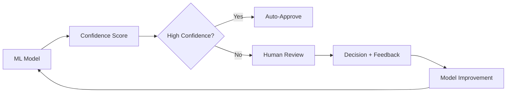

# 10 Hard-Earned Lessons from Running ML Models in Production

After years of deploying ML models at SAP, ZapLabs, and now Twilio, I've learned that the gap between a working model and a production-ready system is vast. Here are the lessons I wish I knew earlier.

## Lesson 1: Your Model is Only 10% of the System

The harsh reality:

```python
# What you think you're building
model = train_amazing_model(data)
deploy(model)  # Done!

# What you're actually building
system = {
    "data_pipeline": "30% of effort",
    "model": "10% of effort",
    "monitoring": "20% of effort",
    "infrastructure": "20% of effort",
    "edge_cases": "20% of effort"
}
```

## Lesson 2: Data Drift is Real and Ruthless

Your model's performance **will** degrade over time. Here's how we detect it:

```python
def monitor_data_drift(current_data, training_data):
    # Statistical tests
    ks_statistic = ks_2samp(current_data, training_data)

    # Distribution comparison
    psi = calculate_psi(current_data, training_data)

    # Feature importance shift
    importance_correlation = compare_feature_importance(
        current_model, baseline_model
    )

    if any([
        ks_statistic.pvalue < 0.05,
        psi > 0.2,
        importance_correlation < 0.9
    ]):
        trigger_retraining_pipeline()
```

**Real Example**: Our lead scoring model at ZapLabs saw a 30% performance drop after COVID-19 changed user behavior patterns overnight.

## Lesson 3: Simple Models Often Win

The temptation to use the latest deep learning model is strong, but:

| Model Complexity | Training Time | Inference Time | Interpretability | Maintenance |
|-----------------|---------------|----------------|------------------|-------------|
| Linear Regression | Minutes | <1ms | High | Easy |
| Random Forest | Hours | <10ms | Medium | Moderate |
| Deep Neural Network | Days | 100ms+ | Low | Complex |

**Case Study**: Replaced a complex ensemble with logistic regression at SAP. Results:
- Accuracy dropped by 2%
- Inference speed improved by 100x
- Debugging time reduced by 80%

## Lesson 4: Version Everything

```yaml
# model_manifest.yaml
model:
  version: "v2.3.1"
  training_data: "dataset_2024_10_15"
  git_commit: "abc123def"
  hyperparameters:
    learning_rate: 0.001
    epochs: 100
  dependencies:
    sklearn: "1.2.0"
    tensorflow: "2.13.0"
  metrics:
    validation_auc: 0.92
    test_auc: 0.91
```

This saved us countless hours when a model suddenly started failing in production.

## Lesson 5: Build for Failure

Your model will fail. Plan for it:

```python
class ResilientPredictor:
    def predict(self, input_data):
        try:
            # Primary model
            prediction = self.primary_model.predict(input_data)

            # Sanity checks
            if not self.is_valid_prediction(prediction):
                raise PredictionError("Invalid prediction")

            return prediction

        except ModelTimeout:
            # Fallback to simpler model
            return self.fallback_model.predict(input_data)

        except Exception as e:
            # Last resort: rule-based system
            log_error(e)
            return self.rule_based_fallback(input_data)
```

## Lesson 6: Feature Engineering > Model Complexity

The best ROI comes from better features, not fancier models:

```python
# Before: Raw features
features = ['age', 'income', 'location']
accuracy = 0.72

# After: Engineered features
features = [
    'age',
    'income',
    'income_to_age_ratio',
    'location_cluster',
    'days_since_last_activity',
    'activity_trend_30d',
    'peer_group_comparison'
]
accuracy = 0.89  # With the same model!
```

## Lesson 7: Monitor Business Metrics, Not Just Model Metrics

```python
# What we used to monitor
metrics = {
    "auc": 0.92,
    "precision": 0.88,
    "recall": 0.85
}

# What we monitor now
metrics = {
    # Model metrics
    "auc": 0.92,

    # Business metrics
    "revenue_impact": "+$2.3M",
    "false_positive_cost": "$45K/month",
    "user_satisfaction": 8.2,
    "processing_time_saved": "400 hours/month"
}
```

## Lesson 8: The Curse of Real-Time

Real-time predictions sound great until you realize:

1. **Latency requirements**: <100ms response time
2. **Cost implications**: 10x more expensive than batch
3. **Complexity**: Caching, failover, scaling

Our solution: **Near real-time** batch processing every 5 minutes covers 95% of use cases.

## Lesson 9: A/B Testing is Harder Than You Think

```python
class MLExperiment:
    def __init__(self):
        self.min_sample_size = self.calculate_sample_size()
        self.stratification_keys = ['user_segment', 'geography']

    def assign_variant(self, user):
        # Consistent assignment
        hash_value = hash(user.id) % 100

        if hash_value < 10:
            return "control"
        elif hash_value < 20:
            return "model_v1"
        else:
            return "production"

    def measure_impact(self):
        # Don't just measure model performance
        return {
            "model_metrics": self.get_model_metrics(),
            "business_metrics": self.get_business_metrics(),
            "operational_metrics": self.get_ops_metrics(),
            "statistical_significance": self.calculate_significance()
        }
```

## Lesson 10: Documentation is Your Future Self's Best Friend

What we document for every model:

```markdown
## Model Card: Lead Scoring v2.3

### Purpose
Predict likelihood of lead conversion within 30 days

### Training Data
- Source: CRM database
- Date range: 2023-01-01 to 2024-01-01
- Sample size: 2.3M records
- Class distribution: 15% positive

### Known Limitations
- Poor performance on leads from APAC region
- Degrades after 60 days without retraining
- Requires minimum 10 interactions for accuracy

### Failure Modes
1. Returns 0.5 for missing features
2. Times out on batches > 10K
3. Memory spike with text features > 1000 chars

### Rollback Procedure
1. Switch traffic to v2.2
2. Clear prediction cache
3. Alert on-call engineer
```

## Bonus Lesson: The Human Element

The best ML system is one that augments human decision-making:



This hybrid approach at Twilio reduced errors by 60% while maintaining 80% automation.

## Key Takeaways

1. **Start simple**: MVP with logistic regression > Complex model that never ships
2. **Monitor everything**: Business metrics > Model metrics
3. **Plan for failure**: Every model fails eventually
4. **Version control**: Code, data, models, configs
5. **Document ruthlessly**: Your future self will thank you

## Tools That Save Lives

- **MLflow**: Model versioning and tracking
- **Prometheus + Grafana**: Monitoring
- **Great Expectations**: Data validation
- **Seldon**: Model deployment
- **WhyLabs**: Data drift detection

## Final Thoughts

Running ML in production taught me humility. The elegant model you built in Jupyter is just the beginning. The real work is building a system that's reliable, maintainable, and actually delivers business value.

Remember: **A simple model in production beats a complex model in development every time.**

---

*Have your own production ML war stories? I'd love to hear them! Find me on [Twitter](https://twitter.com/pruthvishetty) or [LinkedIn](https://linkedin.com/in/pruthvishetty).*